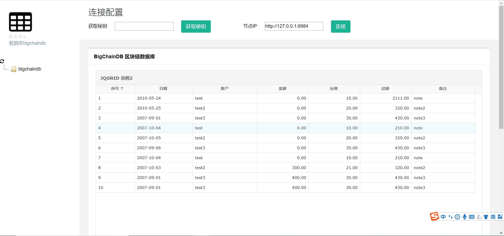

# BDQL工具
## 1.介绍
针对BigChainDB进行SQL查询。网页版可视化查询工具。

## 2.CentOS安装
### 2.1 拉取源码
```
git clone https://github.com/keer123456789/bdqlWeb.git
cd bdqlWeb
git checkout v1.0
```
如果没有git工具，运行`sudo yum install git`

### 2.2 启动项目

如果没有maven工具，运行`sudo yum install maven`。启动项目，运行下列命令：第一次可能会拉依赖，会慢一些，之后启动就好了。

```
mvn spring-boot:run
```

## 3 开始使用
启动项目，启动完成后，访问：[http://127.0.0.1:8080](http://127.0.0.1:8080/)，如图1：



### 3.1 密钥
图1中的`获取密钥`按钮失效，在`bdqlWeb`目录下存放一个`keypair.txt`文件，里面有一个事先生成好的密钥，打开复制出来，粘贴在图二的红框。


### 3.2 输入BigchainDB节点的地址

在图3的红框中输入相应BigchainDB节点的地址。默认是本地的BigchainDB节点。


点击`连接按钮`,会弹出对话框，如图4,连接成功。


### 3.3 使用Insert语句创建资产。
**注意**：列名不需要加引号，每列的值需要用引号。
```
INSERT INTO table_name (column1,column2,column3,...)VALUES (value1,value2,value3,...)
```

### 3.4 使用update语句创建资产的metadata。
**注意**：where后的表达式是固定的。`assetID`是资产ID。
```
UPDATE table_name SET column1=value1,column2=value2,... WHERE ID = assetID;
```
### 3.5 使用select 语句查询
**注意**：
- 不支持多表查询
- 支持`*`查询
- where 支持`<,<=,>,>=`表达式，其他表达式还不支持。
- 无论是asset表名还是metadata表名都尽量不要重名


```
SELECT column_name,column_name FROM table_name where some_column=some_value;
```